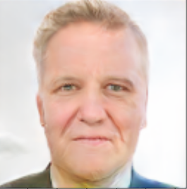
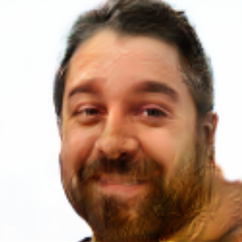
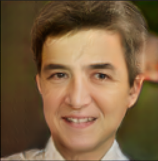
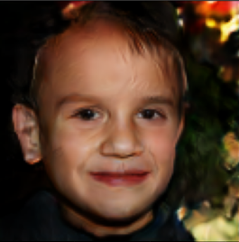

# GAN Image Generator
GAN stands for Generative Aversarial Network.
This technique for image generation uses two types of networks to train; a discriminator and a generator.
- Made by [Emmett Jaakkola](https://www.linkedin.com/in/emmett-jaakkola-234667208/) and [Kyler Nikolai](https://www.linkedin.com/in/kylernikolai/).
## Discriminator
Determines if an input image is from the original dataset. Output is a probability from 0 to 1, where 0 is if it isn't in the dataset and 1 if it is.
## Generator
Generates images from an input noise vector. Tries to generate images that look like ones from the original dataset to fool the discriminator.
## Results
Most are not great, but we've seen a lot of improvement with the later models. Check out some of these images we were able to generate!
## Latest Version
Our latest version generates 128x128 images with three color channels. The model was trained on the
[Flickr Dataset](https://github.com/NVlabs/ffhq-dataset). This contained
higher quality images with less artifacts. This code has a slider that allows you to transition between two different random vectors shown [here](#sliders).

### Generated Images
<table>
  <tr>
    <td></td>
    <td></td>
  </tr>
  <tr>
    <td></td>
    <td></td>
  </tr>
</table>

### Sliders 
<table>
  <tr>
    <td></td>
    <td></td>
  </tr>
</table>