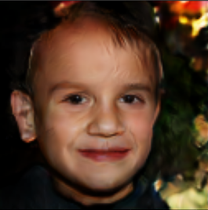

# GAN Image Generator
Using a GAN, the following code generates realistic faces that are completely AI generated.
GAN stands for Generative Aversarial Network.
A GAN uses two types of networks to train; a discriminator and a generator.
## Discriminator
Determines if an input image is from the original dataset. Outputs a probability from 0 to 1. Numbers close to zero suggest the image was made by the genorator, where numbers close to 1 will be output if the discriminator suspects that the image is from the dataset.
## Generator
Generates images from an input vector containing random numbers. Generates images similar to ones in the original dataset to fool the discriminator.
## Model
Our model generates 128x128 images with three color channels. The model was trained on the
[Flickr Dataset](https://github.com/NVlabs/ffhq-dataset). This dataset contains high quality images with minimal artifacts. This code has a slider that allows you to transition between two different random vectors shown [here](#sliders).
Using the `trainNN` function, the model can be trained and can generate images.
`trainNN` function:
- `epochs` - Set to 0 to run the model without training. Every epoch represents one pass through the dataset of 70,000 images.
- `batch_size` - The number of images we train the model on at a time. We found that 128 works best.
- `lr` - How much the model parameters are adjusted after each iteration. Lr = 0.0002 works well for Adam Optimizer.
- `save_time` - The number of epochs before each save.
- `save_dir` - The file where the model is saved and loaded from.
- `slide` - Set true to use sliders and false to generate images.
## Data format
The dataset of 70000 images was stored in a numpy array with dimensions (70000, 3, 128, 128) saved to a .npy file.

### Credit
Made by [Kyler Nikolai](https://www.linkedin.com/in/kylernikolai/) and [Emmett Jaakkola](https://www.linkedin.com/in/emmett-jaakkola-234667208/).

### Generated Images
<table>
  <tr>
    <td></td>
    <td></td>
  </tr>
  <tr>
    <td></td>
    <td></td>
  </tr>
</table>

### Sliders 
<table>
  <tr>
    <td></td>
    <td></td>
  </tr>
</table>
